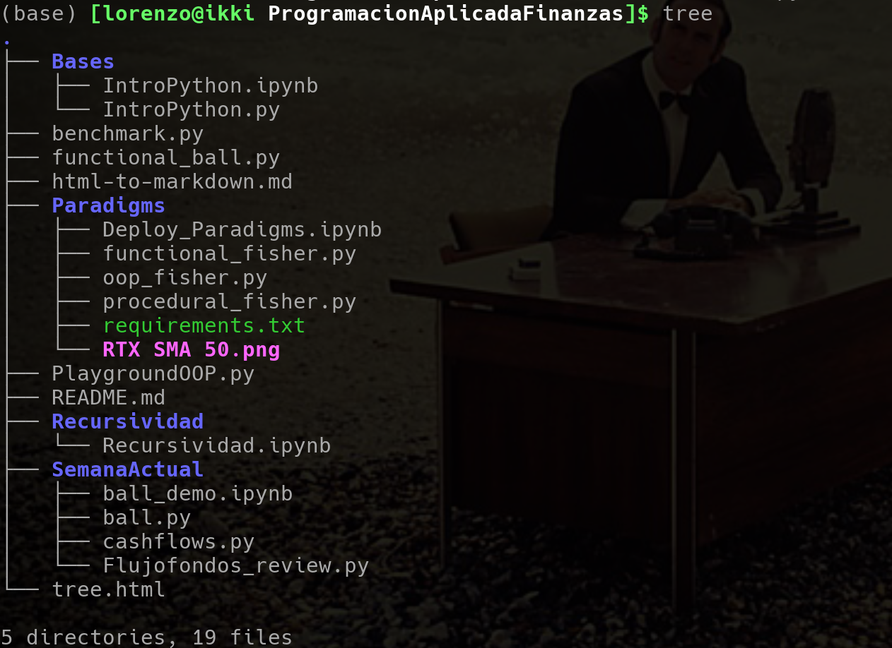

# Programacion Aplicada Finanzas

# Material to Enhance Python 🎩💰

> a list of books and online resources that help me to solve doubts and keep moving forward

## Books

### For Beginners

* [Python For Everybody - Video](https://www.youtube.com/watch?v=UjeNA_JtXME&list=PLlRFEj9H3Oj7Bp8-DfGpfAfDBiblRfl5p) - Charles Severance University of Michigan (GO BLUE) introduction to Python.
* [Python For Everybody - Book](https://do1.dr-chuck.com/pythonlearn/EN_us/pythonlearn.pdf) - Book.

### Starting to use Finance

* [Python for Finance](https://github.com/yhilpisch/py4fi2nd) - Once the basics are covered, its time to jump to finance.

* [Algorithmic Trading](https://github.com/PacktPublishing/Learn-Algorithmic-Trading) - Ok, now you want to go big.

### Sites to Practice or look for ideas

* [Hackerrank](https://www.hackerrank.com/domains/python) - challenges.
* [CodeWars](https://www.codewars.com/collections/basic-python) - challenges.
* [geeks for geeks](https://www.geeksforgeeks.org/) - data source.
* [ws3](https://www.w3schools.com/) - web dev.
* [stack overflow](https://stackoverflow.com/) - site to ask anything.
* [Quora](https://python-programming.quora.com/) - alternative to stack overflow. 
* [computerphile](https://www.youtube.com/@Computerphile) - basics concepts explain by teachers.
* [socratica](https://www.youtube.com/watch?v=nxjwB8up2gI&t=168s) - educator of python.
* [retroactivo](https://www.youtube.com/watch?v=Y2m6bXB2LG4&t=3402s) - nerds siendo nerds, historia.
* [flaviocopes](https://flaviocopes.com/book/read/python/) - consulta documentacion.
